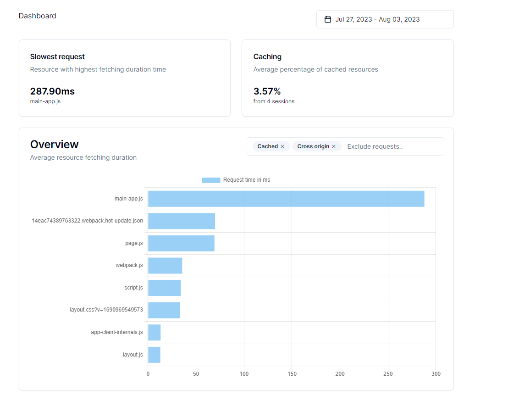

## Resources monitor

Client script and dashboard with data collected from browser Performance API - requests durations and how many were cached in client browser.
Developed with Nextjs with app router and shadcn UI components.

